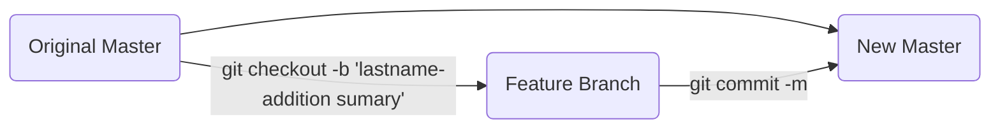

# Self paced Python for Data Science

### Synopsis: 
  A collection of  external python curricula for beginner or intermediate statisticians or who want to level up their python /  data science skills. 

## What's Covered:
 ** = coming soon
1. What is Data Science: Brief Overview
2. Statistics
	3. Combinations and Permutations
	4. Probability distributions**
	5. Regression**
	6. **

3. Python
	1. Basics
	2. Iteration
	3. Functions**
	4.  

4. Machine Learning
	1. History and state-of the art
	2. **

## How to Use This Repository:
***This repo consolidates reading, videos, practices, exercises, and challenges from all over the web to present favorite learning material in a cumulative order that will prepare novice programmers or math students for Data Science projects.***   If you were planning on learning python and data science on your own this repo is for you! It's intended to point you to an ordered, series of progressively more challenging curricula. After you complete a section, you'll see marked improvement and have the skills needed to solve progressively more challenging data and statistics problems.   It's not intended to be your only resource; you will need to supplement  your learning where you feel your skills are under developed.   

  It's not intended to host course material; instead consider this repo like a "news feed" that aggregates learning streams from around the web. That will allow you to start here and branch out. For example, sites like Coursera have great courses on machine learning fundamentals and stats for  psychology and Khan Academy has better courses on basic probability but neither give you great reading material or larger assignments that you can really dig into. You'll find links to all of those sources here peppered with "reach" assignments for added challenge and my own study sheets for interview prep

## How to Contribute to this Repo:
***Use feature-branch workflow***


Clone the Repo:
```bash
git clone git@github.com:john-telfeyan/self-paced-python-for-data-science.git
```
Then please use feature-branch workflow like so; First:
```bash
git checkout -b <feature-name>-<your-name>
```

Add only the required files and use a descriptive commit message like...
```bash
git add learn_python/for_loops.ipnb
git add learn_python/media_files/.
git commit -m "Added the 'FizzBuzz' challenge to for_loops.ipnb"
```
 ...then to push the new feature:
```bash
git push --set-upstream origin <feature-name>-<your-name>
```
email 
Thanks for reading and contributing!
<!--stackedit_data:
eyJoaXN0b3J5IjpbMjY4NjA0MzMzLC0xODE3MzYyMzY1LC00MD
gwNDI1NTldfQ==
-->